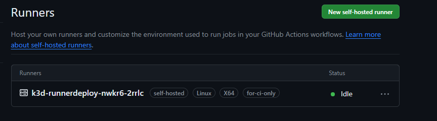
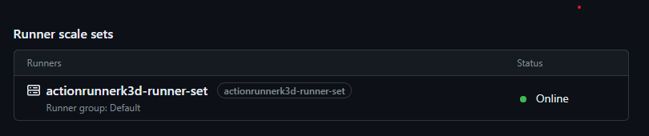
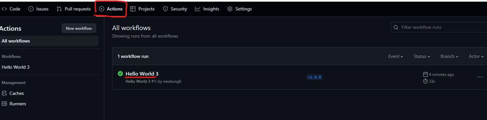
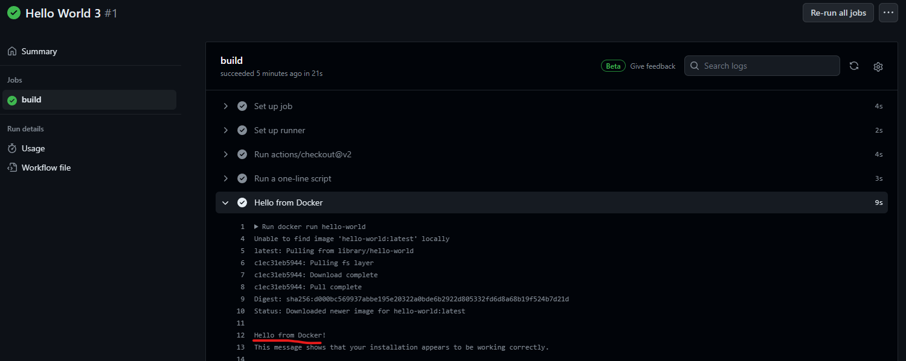

# Action-Runner-101
-[Action-Runner for Community Edition](#actionrunner-for-community-edition)  
-[Action-Runner Official-Edition](#actionrunnerk3d-for-github-official)  
-[Github-Action](#github-action)

# Action-Runner for Community Edition
FOR Simple Runner :https://actions-runner-controller.github.io/actions-runner-controller/  
Full Ref: https://github.com/actions/actions-runner-controller/tree/master
### Preriqisite
Kubecluster (in example is in K3D)  
Create [Access Token](https://github.com/settings/tokens/new)
with Check box (repo , admin:org) 

## Install Cert manager on Kube
Don't Forget to check latest version and install  
https://github.com/cert-manager/cert-manager/releases
```
kubectl apply -f https://github.com/cert-manager/cert-manager/releases/download/v1.13.4/cert-manager.yaml
```

## Install ARC Controller
** Replace PAT(Personal Access Token)
```
helm repo add actions-runner-controller https://actions-runner-controller.github.io/actions-runner-controller
helm repo update

kubectl create ns actions-runner-system

helm upgrade --install --namespace actions-runner-system \
--set=authSecret.create=true \
--set=authSecret.github_token="<***YOUR-PersonalAccessToken***>" \
--wait actions-runner-controller actions-runner-controller/actions-runner-controller
```

## Apply runner-deployment to any namespace you want
kubectl create ns actionrunner  
kubectl apply -f github-runner-community/runner-deployment.yaml -n actionrunner 

runner-deployment.yaml
```
apiVersion: actions.summerwind.dev/v1alpha1
kind: RunnerDeployment
metadata:
  name: runner-deploy-jimmy #can change name
spec:
  replicas: 1
  template:
    spec:
      repository: newkung6/actionrunner-selfhost #Github repo url user/repo
      labels:
      - for-community-only #tag for run-on
```

after pod running. Check Repo runner  


# Actionrunner For Github Official 
Ref 1: https://docs.github.com/en/actions/hosting-your-own-runners/managing-self-hosted-runners-with-actions-runner-controller/quickstart-for-actions-runner-controller  
Ref 2: https://medium.com/simform-engineering/how-to-setup-self-hosted-github-action-runner-on-kubernetes-c8825ccbb63c

### Preriqisite
Kubecluster (in example is in K3D)  
Create [Access Token](https://github.com/settings/tokens/new)
with Check box (repo , admin:org) 

Create runner Namespace and create secret
```
kubectl create ns arc-runners
kubectl create secret generic pre-defined-secret \
   --namespace=arc-runners \
   --from-literal=github_token='<***YOUR-PersonalAccessToken***>'
```
your copy of the values.yaml file, pass the secret name as a reference.  
secretvalues.yaml
```
githubConfigSecret: pre-defined-secret
```

## Install CRD Controller
```
NAMESPACE="arc-systems"
helm install arc \
    --namespace "${NAMESPACE}" \
    --create-namespace \
    oci://ghcr.io/actions/actions-runner-controller-charts/gha-runner-scale-set-controller \
    -f github-runner-official/secretvalues.yaml
```

## Config Runner Scale set
INSTALLATION_NAME = "Name-You-Want-To-Design
```
INSTALLATION_NAME="arc-runner-set"
NAMESPACE="arc-runners"
GITHUB_CONFIG_URL="https://github.com/newkung6/actionrunner-selfhost" #<user>/<repo>
GITHUB_PAT="<PAT>"
helm install "${INSTALLATION_NAME}" \
    --namespace "${NAMESPACE}" \
    --create-namespace \
    --set githubConfigUrl="${GITHUB_CONFIG_URL}" \
    --set githubConfigSecret.github_token="${GITHUB_PAT}" \
    oci://ghcr.io/actions/actions-runner-controller-charts/gha-runner-scale-set
```
IF pod Created. You will see runner in repo


# Github-action
Ref : https://docs.github.com/en/actions  

Main Target file : .github/workflows

### Sample "hello world from docker" using SelfHost
```
# This is a basic workflow to help you get started with Actions
name: Hello World

# Controls when the action will run.
on:
  push:
    tags:
    - 'v1.*.*'   #triger when push tag v1.x.x
  # Allows you to run this workflow manually from the Actions tab
  workflow_dispatch:

# A workflow run is made up of one or more jobs that can run sequentially or in parallel
jobs:
  # This workflow contains a single job called "build"
  build:
    # The type of runner that the job will run on
    runs-on: for-community-only  #change selfhost-name here
    # Steps represent a sequence of tasks that will be executed as part of the job
    steps:
    # Checks-out your repository under $GITHUB_WORKSPACE, so your job can access it
    - uses: actions/checkout@v2

    # Runs a single command using the runners shell
    - name: Run a one-line script
      run: echo Hello, world!

    # # Runs docker hello-world
    - name: Hello from Docker
      run: docker run hello-world
```

After push You can Check what Process is Running  
Or check error log when fail to build

### Result

