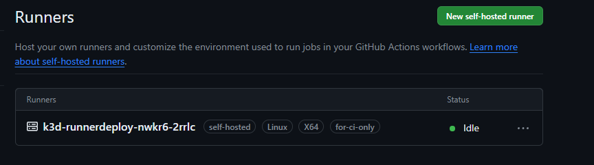

# ActionrunnerK3d for repo test
FOR Simple Runner :https://actions-runner-controller.github.io/actions-runner-controller/
Full Ref: https://github.com/actions/actions-runner-controller/tree/master
### Preriqisite
Kubecluster (in example is in K3D) 
Create [Access Token](https://github.com/settings/tokens/new)
with Check box (repo , admin:org) 

## Install Cert manager on Kube
Don't Forget to check latest version and install
```
kubectl apply -f https://github.com/cert-manager/cert-manager/releases/download/v1.8.2/cert-manager.yaml
```

## Install ARC Controller
```
helm repo add actions-runner-controller https://actions-runner-controller.github.io/actions-runner-controller
helm repo update

kubectl create ns actions-runner-system

helm upgrade --install --namespace actions-runner-system \ --set=authSecret.create=true \--set=authSecret.github_token="YOUR-AccessToken" --wait actions-runner-controller actions-runner-controller/actions-runner-controller
```

## Apply runner-deployment to any namespace you want
kubectl create ns actionrunner-k3d
kubectl apply -f runner-deployment.yaml

```
apiVersion: actions.summerwind.dev/v1alpha1
kind: RunnerDeployment
metadata:
  name: k3d-runnerdeploy  #can change
spec:
  replicas: 1
  template:
    spec:
      repository: newkung6/ActionrunnerK3d #Github repo url user/repo
```

after pod running. Check Repo runner
